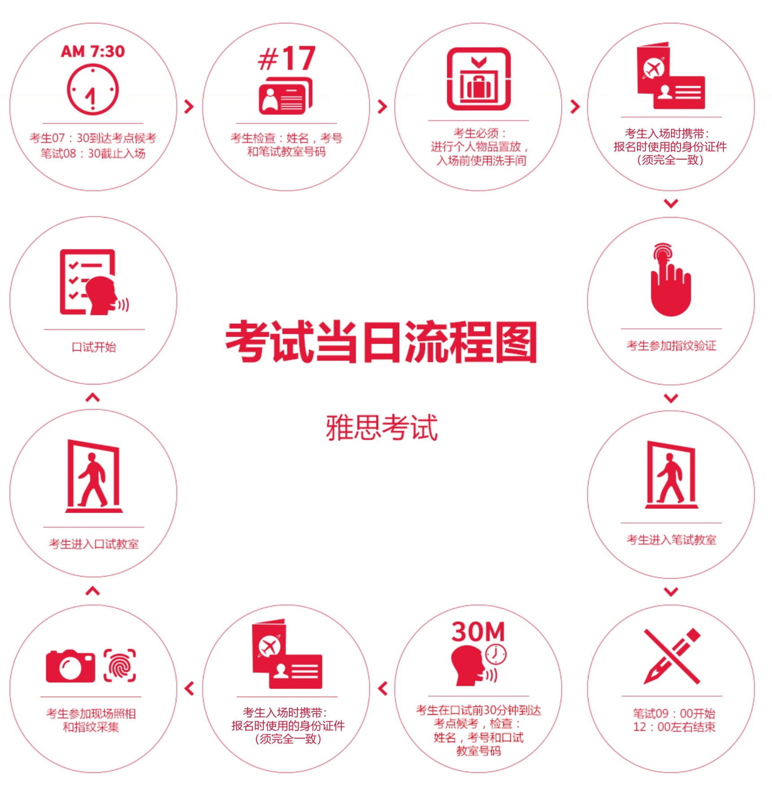

- [雅思备考](#雅思备考)
  - [雅思考试介绍](#雅思考试介绍)
    - [介绍](#介绍)
    - [分类](#分类)
    - [考试科目](#考试科目)
    - [报名网站](#报名网站)
    - [报名流程](#报名流程)
    - [考试当天](#考试当天)
    - [考试有效期](#考试有效期)
    - [评分制](#评分制)
    - [分数段解读](#分数段解读)
    - [题型介绍](#题型介绍)
      - [听力](#听力)
      - [阅读](#阅读)
      - [写作](#写作)
      - [口语](#口语)
  - [自学备考攻略](#自学备考攻略)
    - [听力](#听力-1)
    - [阅读](#阅读-1)
    - [写作](#写作-1)
    - [口语](#口语-1)

# 雅思备考

## 雅思考试介绍

简单介绍雅思整体考试，分别它的介绍、分类、考试科目、考试形式、考试流程、题型等几方面介绍。

### 介绍

雅思（International English Language Testing System，简称 IELTS /aɪˈɛlts/），本质就是一门**评价英语水平**的考试，一般出国留学、出海打工、移民都比较认可雅思考试，比较权威。

### 分类

从大类上来说，分为三种雅思考试：

1. 雅思考试，通用的；

2. 用于英国移民及签证的雅思考试，专门用于英国地区的；

3. 雅思考试生活技能类。

第三种生活技能类比较简单，考试形式也不复杂，本文略过。

主要介绍第一和第二类，这两种雅思考试从细分上都一样，都分为：

1. **学术类**（A 类，Academic）：出国留学，读本科、研究生用到

2. **培训类**（G 类，General Training）：移民，出海打工

### 考试科目

考试形式无非**听说读写**这四样。

但是雅思考试几点不太一样，首先，听力、阅读、写作这三样，跟口语是分开考试的。

其次，听力、阅读、写作的考试形式分为笔考和机考，笔考就跟高考四六级一样，正常的纸质试卷考试，机考就是电脑考试。

口语是单独考试的，就是有一个老外面对面跟你聊 10 多分钟。

### 报名网站

- https://ielts.neea.cn/
- https://ielts.neea.edu.cn/

### 报名流程

### 考试当天

参考地址：https://www.chinaielts.org/ielts_test_day/test_day_procedure.shtml

### 考试有效期

通常 **2 年内**有效。

### 评分制

9 分评分制，听说读写四门各自的分数除以 4 就得的总成绩：

总分除以 4 后，平均分不一定是整数，所以雅思采取了类似于四舍五入的方式：

假设你的平均分是 8.875 或者 8.75，那么会总分会变为 9 分，但如果平均分是 8.625 ，总会只会是 8.5 分

总结下就是，小数部分大于或等于 0.25/0.75 分，那么就入为 0.5/1.0 分，小于 0.25/0.75 分，舍掉为 0.0/0.5 分

听力、阅读、口语、写作成绩描述见：https://www.chinaielts.org/9point.shtml

### 分数段解读

[写作成绩描述](./%E9%9B%85%E6%80%9D%E8%80%83%E8%AF%95%E5%86%99%E4%BD%9C%E6%88%90%E7%BB%A9%E6%8F%8F%E8%BF%B0.pdf)

[口语成绩描述](./%E9%9B%85%E6%80%9D%E8%80%83%E8%AF%95%E5%8F%A3%E8%AF%AD%E6%88%90%E7%BB%A9%E6%8F%8F%E8%BF%B0.pdf)

[听力成绩描述](./%E9%9B%85%E6%80%9D%E8%80%83%E8%AF%95%E5%90%AC%E5%8A%9B%E6%88%90%E7%BB%A9%E6%8F%8F%E8%BF%B0.pdf)

[阅读成绩描述](./%E9%9B%85%E6%80%9D%E8%80%83%E8%AF%95%E9%98%85%E8%AF%BB%E6%88%90%E7%BB%A9%E6%8F%8F%E8%BF%B0.pdf)

### 题型介绍

#### 听力

1. 30 分钟。

2. 有 4 段对话和独白，一共有 40 道题。

3. 每段听力材料只放 1 遍。

4. 材料中有不同口音，英式、美式、澳洲式、新西兰式。

听力材料内容：

| 部分 | 话题范围 | 材料内容 | 主要的考察重点 | 题目数量 |
| ---  | ---      | ---       | ---           | ---      |
| 1 | 社会生活 | 双向交流的谈话（如关于旅行安排的对话）|理解和记录特定的事实性信息 | 10 |
| 2 | 社会生活 | 具有交流目的的独白 (如介绍博物馆开放时间) |理解和记录特定的事实性信息| 10 |
| 3 | 教育和培训 | 2-4人在学术环境下的讨论 (如辅导或讨论会；老师和学生关于作业的讨论) | 理解涉及语义猜测的对话。理解特定的信息、态度和发言者的看法。 | 10 |
| 4 | 教育和培训 | 在学术环境下的独白 (如一般性学术话题的讲课内容) |理解学术论证。理解特定的信息、态度和发言者的看法。 | 10 |

题型

| 题型   | 内容                           |
|--------|--------------------------------|
| 题型1 | 完成填表/记笔记/流程图/总结 |
| 题型2 | 选择题                       |
| 题型3 | 填空题                      |
| 题型4 | 完成句子                    |
| 题型5 | 为图表、计划或地图进行标记 |
| 题型6 | 分类                          |
| 题型7 | 配对                           |

#### 阅读

1. 60 分钟
2. 3 篇文章，一共 40 道题
3. 文章都来自于真实的材料，杂志、期刊、书籍和报纸等

题型

| 题型 | 学术类 | 培训类
| --- | --- | --- |
| 题型一 | 选择 | 选择
| 题型二 | 填空 | 填空
| 题型三 | 完成句子 | 完成句子
| 题型四 | 完成笔记、总结、表格或流程图 | 完成笔记、总结、表格或流程图
| 题型五 | 对图表进行标记 | <u>多项配对</u>
| 题型六 | 为段落或文章的部分选择相对应的小标题 | 为段落或文章的部分选择相对应的小标题
| 题型七 | 寻找信息 | 寻找信息
| 题型八 | 寻找作者观点、论点或文章中的具体信息 | 寻找作者观点、论点或文章中的具体信息
| 题型九 | 分类 | 分类
| 题型十 | 配对 | 配对
| 提醒十一 | / | <u>完成总结</u>

#### 写作

1. 60 分钟
2. **小作文**：一篇 150 字的文章，需要考生进行分析、描述或说明一张表格，曲线图，柱状图或示意图
3. **大作文**：一篇 250 字的议论性文章

#### 口语

| 部分 | 时间长度 | 互动的内容 | 考察能力 |
| ---- | -------- | ------ | ----- |
| 1    | 4-5分钟  | <u>简介以及问答</u>： 考官会向考生进行自我简介，并核对考生的身份。之后，考官会就考生熟悉的话题(如朋友、兴趣习惯或者食物) 进行询问。为保证题目的一致性，这些问题都是从一个事先拟定的范围内抽取的。  | 考生就日常性的观点和信息、常见的生活经历或情形以回答问题的形式进行交流的能力。 |
| 2    | 3-4分钟  | <u>个人陈述</u>： 考官会交给考生一个答题任务卡、铅笔和草稿纸做笔记。答题任务卡上会给出一个话题和需要在个人陈述中包含的要点，并在最后提示考生解释这个话题的某一个方面。考生有一分钟的准备时间(如笔记)，然后需就此话题进行1到2分钟的陈述。考官会在2分钟后打断考生，并在最后提问一两个问题作为结束语。  | 考生(在没有任何其它提示的情况下)就一个特定的话题进行较长时间的陈述的能力，考察考生是否能恰当地运用语言、是否能连贯地组织自己的观点。考生有可能需要联系自己的经历来完成这部分内容。 |
| 3    | 4-5分钟  | <u>双向讨论</u>： 考官将与考生就第二部分中出现的话题较为抽象的部分进行双向讨论。 | 考生表达和论述看法、分析、讨论以及深入思考问题的力。 |

## 自学备考攻略

雅思报班作用有限，费用较高，主要还是要靠个人投入，综合网上大量经验贴、备考视频，认为，总结出自学雅思备考的最佳实践。

### 听力

听力这块毫无争议，大部分博主只推荐**王陆的《雅思王听力——真题语料库》**：

- 重点章节：3，4，5，8，11

- 重中之重：5，11

刷题就可以，视频可以看一下 B 站的免费课，技巧基本全涵盖了。

推荐倍速练习法：先 1.0x，再 1.2x，以此类推往上倍速练习。

### 阅读

📌 FIXME

阅读推荐刘洪波+刷剑桥雅思+《九分达人》：

### 写作

📌 FIXME

顾家北写作+simon 网课

### 口语

📌 FIXME

听力分为三个部分

第一部分是介绍自己，不需要准备

第二部分是考官从题库里面抽一道题，然后考生叙述

第三部分是根据第二部分进行提问

口语考场大忌：背题，推荐一个故事串记：

[「爆炸干货」什么？一个故事可以串47道雅思口语题？!_哔哩哔哩_bilibili](https://www.bilibili.com/video/BV19E411Z7MS/)

> [https://www.lonelyplanet.com/](https://www.lonelyplanet.com/)
